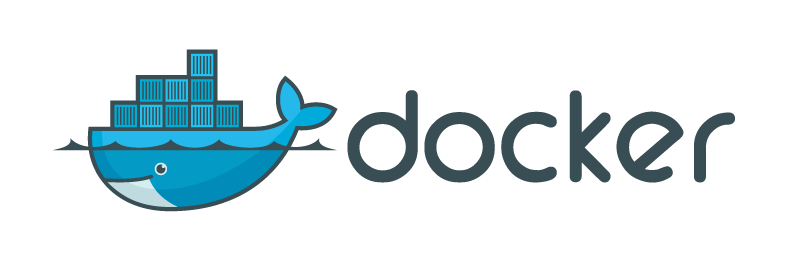

Docker, ce game changer qu'un certain Solomon Hykes venait (bien trop) rapidement presenter en pleine PyCon UK 2013 ([souvenirs](https://www.youtube.com/watch?v=wW9CAH9nSLs)) change radicalement la vie des (dev)ops. Mais pour un dev' tout court, quelle utilité ?
Spoiler Alert : Docker (et Docker-Compose) va permettre de déclarer de manière simple et portable un ensemble de services tiers liés à notre application. Chaque dev peut alors mettre en route en quelques instants un environnement de développement _iso_ à celui du reste de son équipe. Ou du reste du monde. Portabilité bonjour.

## Compose toi toi-même

[Docker-Compose](https://docs.docker.com/compose/), anciennement Fig créé par [Orchard](https://www.orchardup.com/) (racheté par Docker Inc. depuis) est un outil qui permet de facilement déclarer dans un fichier YaML les différents services qui lient notre applications. On y décrit comment les conteneurs qui accueillent les services dont notre application a besoin sont liés entre eux et doivent se comporter (ports à exposer, volumes à monter, etc...) comme on le ferait en ligne de commande avec le client `docker`. Exemple ici pour un wiki simpliste :

```yaml
Mediawiki:
  image: "nickstenning/mediawiki:latest"
  links:
    - "MySQL:mysql"
  ports:
    - "8088:80"
  volumes:
    - "/var/mediawiki:/data"
MySQL:
  image: "centurylink/mysql:5.5"
  ports:
    - "3306:3306"
  expose:
    - "3306"
  environment:
    - MYSQL_ROOT_PASSWORD=MediaWiki.123
```

NOTE: Note: Cet exemple est honteusement pompé sur [Lorry.io](https://lorry.io/) (voir lien en fin d'article). En plus des services dont dépend notre projet, on peut déclarer des services de monitoring, un stack ELK portable, des services de mocks, etc... Ultra-pratique.

On sort le CLI docker-compose (`pip install docker-compose`) et on commence à orchestrer tout ce petit monde :

```bash
docker-compose start ./docker-compose.yml
```

Le fichier est alors passé au démon Docker qui va se charger de récupérer ou build les images selon les cas et démarrer les conteneurs demandés avec un nom parlant. Voilà, votre environnement de dev est prêt!

## Ce n'est que du texte

...Et le texte, ça se versionne très simplement ! Comme ce bon vieux `requirements.txt` bien connus des Pythonistes qui permet déjà de récupérer les dépendances d'un projet, on applique le même traitement à notre environnement. En ajoutant le fichier `docker-compose.yml` à un dépôt de versionning git par exemple, on permet à n'importe qui de rapidement cloner le dépôt et monter un environnement de développement. Plus besoin d'installer tout un tas de paquets sur sa machine ni de monter une VM dédiée.

En bonus, on peut joindre au dépôt un `Dockerfile` et ajouter notre projet dans le `docker-compose.yml` pour qu'une instance soit lancée en même temps que le reste de l'environnement : _Docker-ception_.

## Docker est "Development-Ready"

Cela change radicalement des worklows de développement où l'on passait un temps fou à trouver une machine propice au développement d'un projet en particulier, où l'on installait en dur sur sa machine un moteur de base de données, un serveur web, etc...

Même avec l'avènement de solutions comme Vagrant, on avait toujours besoin d'avoir un moteur de machines virtuelles (VirtualBox, VMWare, etc...). Docker nous facilite grandement la vie et gère toute la complexité de partager un environnement de dev de bout en bout.

En production, la donne est légèrement différente (car les problématiques ne sont pas les mêmes). Mais les solutions compatibles avec ce workflow de développement existent ! Tous les grands _cloud providers_ proposent déjà un service de _hosting_ de conteneurs; et chacun applique sa propre sauce d'orchestration des services. [GiantSwarm](https://giantswarm.io/), un _cloud provider_ proposant une offre de PaaS pensée pour gérer des conteneurs possède son propre vocabulaire de summary des services : c'est un dernier fichier YAML à joindre à son code et "pouf" votre application est déployée en poussant votre code - "Heroku-style", mais on parle ici de _tous_ les composants (ou micro-services) de votre application, même les services tiers comme la BDD, etc...).

NOTE: Note: GiantSwarm est actuellement en phase d'early access. J'ai la chance de pouvoir tester leurs services et je vous assure que le mot déploiement revêt un sens nouveau depuis que je teste leur plate-forme. Allez y faire un tour.

Enfin, [Rancher](http://rancher.com/rancher-feature-iii/), un moteur de PaaS à installer soi-même comme un grand à choisi d'utiliser la grammaire de docker-compose (on peut donc lui donner à manger un `docker-compose.yml` et il se charger de monter nos services !) et de l'étendre avec un `rancher-compose.yml` qui permet de définir des règles d'auto-scale, de load-balancing et plus encore.

L’approche de Rancher, pendant que j’y suis, est assez originale : votre outil d'orchestration est lui aussi rangé dans un conteneur. Il est multi-environnement, possède une bel interface web et l’équipe à l’origine du projet propose également _RancherOS_, un OS ou quasiment _tout_ est conteneurisé. Je pourrais vous en parler des heures, mais vous êtes déjà parti vous monter un cluster _CoreOS_ pour tester tout ça, je le sais bien.

Et vous ? Docker en environnement de dev ? de prod ?!

## Quelques liens

- Docker-Compose: https://docs.docker.com/compose/
- Giant-Swarm : https://giantswarm.io/
- Rancher / Rancher OS : http://rancher.com/
- Lorry.io : https://lorry.io/
