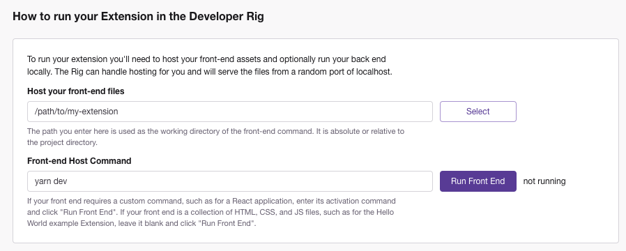

# Bootstrapping a Twitch Extension with NextJS

Twitch Extension allow broadcasters to engage their audience in many different ways. It's bringing a whole new level of interactivity to your ordinary gaming channel. Under the hood, it is a collection of HTML/JS pages hosted by Twitch. As is it mainly tiny JS apps, you can bring your favorite tools with you.

One of the tool I use more and more these day is NextJS. It's a powerful framework for building producion-ready React Apps. When I started to develop a Twitch extension, I naturally wanted to start with a NextJS app structure. After a bit of tweaking, I was able to put together a familiar development setup.

## Let's do this

I'll guide you through a couple steps to get you up and running. Starting from here, all you need is your usual dev machine and some basic knowledge of JS and React. Bonus points if you are already used to Twitch extensions, advanced React apps, and/or NextJS itself!

Let's scaffold our NextJS project with `create-next-app`, a very handy script which will setup your new project. Open a terminal and type :

```sh
npx create-next-app my-extension # or 'yarn create-next-app my-extension'
```

Allright ! Now, `cd` into your new project folder and open a text editor of your choice. In a NextJS project, each page of your app sits in the `pages` folder (sic).

Twitch extensions are divided into pages, too, . As a simple example, let's assume we are building a *panel* extension (see [this page](https://dev.twitch.tv/docs/extensions/): "A panel extension appears in the panel area below the video player. Panel Extensions stay active even when the channel is not live."). Rename `pages/index.html` into `pages/panel.html`.

Create a new `next.config.js` file at the root of your project like this one :

```js
const isProduction = process.env.NODE_ENV === "production";

module.exports = {
  assetPrefix: "./",
  env: {
    STATIC_PREFIX: isProduction ? "./static" : "/static"
  },
  exportPathMap: async (
    defaultPathMap,
    { dev, dir, outDir, distDir, buildId }
  ) => {
    return !dev
      ? {
          "/panel": { page: "/panel.html" },
          "/live_config": { page: "/live_config.html" },
          "/config": { page: "/config.html" }
        }
      : defaultPathMap;
  },
  webpack(config, options) {
    config.optimization.minimize = false;
    return config;
  }
};
```

Wait! What are we doing here?

- `assetsPrefix` tells NextJS that we need to use a relative path to find our bundled assets (see [this page](https://nextjs.org/docs#cdn-support-with-asset-prefix))
- `exportPathMap` lists the pages we want NestJS to export. in the example above, I'm assuming you are developing a "Panel"-only extension. You might want to adjust this based on your needs, re-using the same syntax (`"/<page_name>": { page: "/<page_name>.html" }`).
- `config.optimization.minimize = false;` makes sure Webpack won't minimize your files when bundling them. You will need your file not to be minimized to submit your extension for review later.

Finally, add the following convenience scripts to your `package.json` :

```js
{
  // (...)
  "scripts": {
    // (...)
    "prerelease": "rm -rf .next out",
    "release": "NODE_ENV=production next build && next export && cd out && zip -qr bundle.zip *"
  }
}
```

- `release` builds your site, export it as static html and then zip for you so you can upload it to your Developer Console isntantly!
- `prerelease` will be run just before `release` to ensure you don't bundle old, stale files.

"And voilà", you are all set ! Now, you can start developing your extension logic.

## Developing your extension locally

Using the [Twitch Developer Rig](https://dev.twitch.tv/docs/extensions/rig/), you can easily use this NextJS setup on your local machine. I won't go through the Rig setup as it is straightforward, but be sure to configure your extension before using it in the Rig: go to your [Twitch developer console](https://dev.twitch.tv/console) and make sure that the "Testing Base URI" is set to `http://localhost:3000` (the default for a NextJS project).


Once you have your project in your Rig, make sure you tells it the right command for Front End, i.e. `npm run dev` (or `yarn dev`).



You should be able to launch "views" inside the rig and play with your extension!


Once your done with your developments, just use the `yarn release` command and you'll be ready to upload your `bundle.zip` on the console, in the "Files" tab.

Easy, right ? You can now proceed with the final steps on your Twitch Dashboard (move to hosted test, submit for review... and release !)

## One more thing

Last month we launched our latest Twitch Extension, "Nice Shot!", a viewer engagement tool for Rocket League streamers. It's already live [here](https://www.twitch.tv/ext/261g5l1br1xjmk201lf6ohm4y9xx7z)! Give it a try and tell us what on think on [Twitter](https://twitter.com/Djiit).
