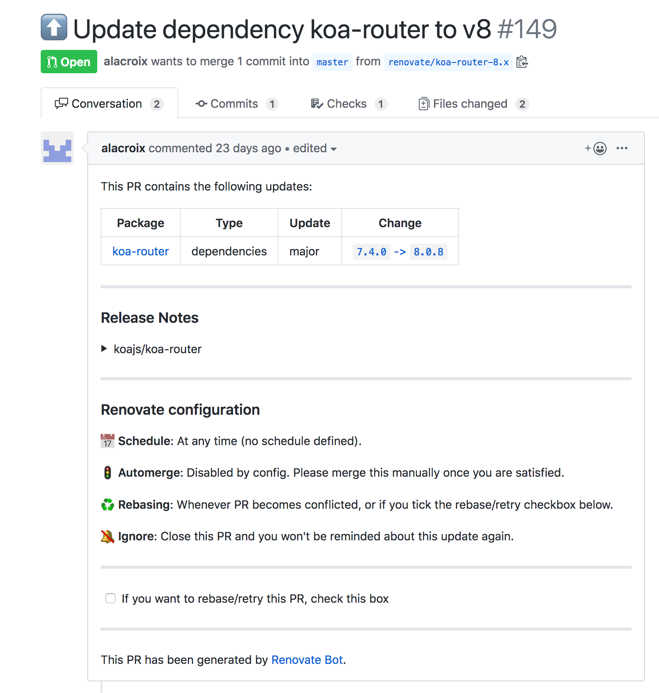

With a little help from [Renovate](https://renovate.whitesourcesoftware.com/) and the powerfull [Github Actions](https://github.com/features/actions), it's becoming really easy to keep your dependencies up-to-date automatically. Let's see how we can easily setup an automated workflows to handle this for us for free!

# Renovate all the things

In a few words : Renovate automatically keeps your dependencies up to date by regularly checking for available updates and opening PRs on your repository, using all your already available CI mechanisms.

Seems great, right ? Let's see how that works :

The first time you run it, it will try to detect which language you use, or if you have a Dockerfile, and so on. It will then create a PR with an initial configuration (in a `renovate.json`) so you can get started quickly.

Then, it will open PRs with updated dependencies. If you have some CI system testing your PRs, you will quickly see if the proposed changes passes the tests or not. If everything is green, you can safely merge the PR ! You can even tell Renovate to automatically merge the PR the next time it scans your repository if all tests pass.



Of course, you can fine tune Renovate's behavior, e.g. to auto-merge patch updates only, or to completely ignore major updates, etc... But we won't cover that now :).

# Rolling... Actions!

GitHub Actions is a great tool to automate repetitive tasks on your repository, like PR triage or small review tasks -- it can also act like a complete CI solution (that's what we do at [Dior.com](https://www.dior.com)!). Plus, it comes with a generous free plan!

First, we need to give Renovate some permissions to "scans" your repository.

Go to **Settings** > **Developer settings** > **Personal access tokens** and Create a Personal Acces Token (PAT) with the `repo` scope.


Now, add it to your repository's secrets.


Now, simply create a file in `.github/workflows` :

```yml
on:
  schedule:
    - cron: "0 8 * * *"
name: Daily Jobs
jobs:
  renovate:
    name: Renovate
    runs-on: ubuntu-latest
    steps:
      - name: Checkout
        uses: actions/checkout@master
      - name: Run Renovate
        uses: docker://renovate/renovate:19.133-slim
        env:
          RENOVATE_REPOSITORIES: <owner/repository-name>
          RENOVATE_TOKEN: ${{ secrets.RENOVATE_TOKEN }}
          RENOVATE_AUTOMERGE: true # optional, see below
```

Here we are defining a simple workflow triggered periiodically by Github Actions. It contains one job which does the following actions :

1. Clone your repository
2. Run Renovate

Simple, right ? We are just passing your newly created PAT and your repository's name. Remember to always pin the versions (tags, actually) of the Docker images you use, specially if it's a public one. You really want to avoid bad surprises if something gets broken some day.

You can add as many environment variables as you want; check the [Renovate Self-Hosted Coonfiguration Docs](https://docs.renovatebot.com/self-hosted-configuration/) for the complete variables list.

Now, Github Actions will take care of running this job every day at 08 AM (feel free to customize the schedule option at will).

That was quick, right ? What do you think ?
